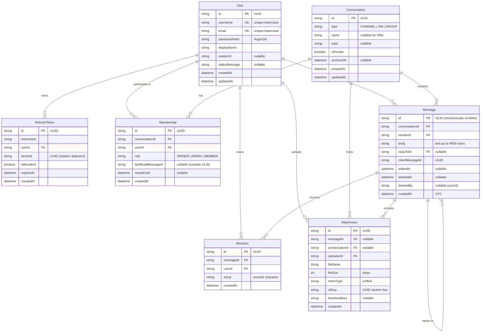

# M0: Architecture Plan & Technical Specification

> **Project:** Slack/Discord-Lite Production-Grade Real-Time Chat Platform  
> **Milestone:** M0 (Plan - No Code)  
> **Status:** APPROVED FOR IMPLEMENTATION  
> **Target Directory:** `realtime-chat/`

---

## 1. Assumptions & Design Decisions

### 1.1 Core Assumptions
1. **Isolation:** The entire chat system is strictly scoped to the `realtime-chat/` directory to avoid colliding with any parent workspace files or existing projects in `New folder (2)`.
2. **Sortable Monotonic IDs:** All messages use **ULIDs** (`ulidx`) generated server-side. ULIDs provide lexicographically sortable, millisecond-precision, 128-bit identifiers that guarantee chronological order without relying on client device clocks or Postgres auto-increment sequences.
3. **Idempotent Deliveries:** Every message send request carries a client-generated UUID `clientMessageId`. A database unique constraint on `(senderId, clientMessageId)` ensures duplicate socket emits (e.g. on unstable cellular connections) return the existing message record rather than duplicating messages.
4. **Token Family Rotation:** Refresh tokens are bound to a `familyId` UUID. If an expired or already-rotated refresh token is presented, the system detects replay attacks, immediately revokes the entire token family, and forces re-authentication across all user sessions.
5. **Presence Heartbeats:** Sockets register user presence in Redis using sets `user:sockets:{userId}` and keys `presence:{userId}` with a 60-second TTL. Periodic heartbeats refresh the TTL. If a server node crashes, Redis TTL expiration automatically cleans up stale "online" statuses. Presence updates are published only to users sharing mutual conversations (`conv:{conversationId}`).
6. **Storage Layer:** MinIO is used in local and test environments as an S3-compatible object store. All uploaded files are validated by magic byte sniffing (`file-type`), stored under random UUID keys (`uploads/{year}/{month}/{uuid}.ext`), and served with safe download headers (`Content-Disposition: attachment`, `X-Content-Type-Options: nosniff`).
7. **Virtualization & Rendering:** The web frontend employs `react-virtuoso` for smooth message scrolling, rendering thousands of messages with sub-millisecond DOM overhead, pinned bottom scrolling, and bidirectional prepending for history pagination.

---

## 2. Final System Architecture

```
                                  +-----------------------+
                                  |     Web Client        |
                                  | React 18 / Vite / TS  |
                                  | TanStack Query / Zu   |
                                  +-----------+-----------+
                                              |
                          REST Requests       |       WebSockets (Socket.IO)
                          (/api/v1/*)         |       (ws://.../socket.io)
                                              |
                                              v
                              +---------------+---------------+
                              |    Express + Socket.IO Node   |
                              |        (Node.js 20+ TS)       |
                              |  - Zod Validation             |
                              |  - Jose JWT Auth (Argon2id)   |
                              |  - Central Error Handler      |
                              |  - Pino Structured Logging    |
                              +-------+---------------+-------+
                                      |               |
                         Prisma Query |               | Redis Adapter / Presence
                                      v               v
                         +------------+---+     +-----+----------+
                         |  PostgreSQL 16 |     | Redis 7 Pub/Sub|
                         |  (GIN search,  |     |  - Adapter     |
                         |   ULID order)  |     |  - Rate limits |
                         +----------------+     |  - Presence    |
                                                +----------------+
                                      |
                                      v S3 API
                         +------------+---+
                         |  MinIO / S3    |
                         | (Uploads Store)|
                         +----------------+
```

### 2.1 Transport Split
- **HTTP REST (`/api/v1`):** Authentication (`/auth/*`), user profile management (`/users/*`), conversation CRUD (`/conversations/*`), message history keyset pagination (`/conversations/:id/messages`), full-text search (`/conversations/:id/search`), and file uploads (`/uploads`).
- **Socket.IO Real-Time:** Send/edit/delete messages, emoji reactions, typing indicators, presence broadcasts, read receipt updates, and reconnect catch-up synchronization.

### 2.2 Scaling & Multi-Node Support
- All servers are 100% stateless.
- Real-time broadcasts leverage `@socket.io/redis-adapter` backed by Redis 7. An event emitted on Node Instance A targeting room `conv:123` seamlessly reaches clients connected to Node Instance B.

---

## 3. Monorepo Directory Layout

```
realtime-chat/
├── .env.example
├── .gitignore
├── .eslintrc.cjs
├── .prettierrc
├── docker-compose.yml
├── package.json                     # Workspaces: ["packages/*", "apps/*"]
├── tsconfig.base.json
├── M0_PLAN.md                       # This file
├── packages/
│   └── shared/                      # Shared types, Zod schemas, socket contracts
│       ├── package.json
│       ├── tsconfig.json
│       └── src/
│           ├── index.ts
│           ├── constants.ts
│           ├── schemas/
│           │   ├── auth.schema.ts
│           │   ├── conversation.schema.ts
│           │   ├── message.schema.ts
│           │   └── user.schema.ts
│           ├── socket-events.ts
│           └── types.ts
├── apps/
│   ├── server/                      # Express + Socket.IO Backend
│   │   ├── Dockerfile
│   │   ├── package.json
│   │   ├── tsconfig.json
│   │   ├── vitest.config.ts
│   │   ├── prisma/
│   │   │   ├── schema.prisma
│   │   │   ├── seed.ts
│   │   │   └── migrations/
│   │   └── src/
│   │       ├── config/              # Validated environment & constants
│   │       ├── errors/              # Central AppError & HTTP handlers
│   │       ├── middleware/          # Auth, CORS, Helmet, Rate limiting, Request ID
│   │       ├── routes/              # Express API v1 route definitions
│   │       ├── controllers/         # HTTP request/response handlers
│   │       ├── services/            # Pure business logic (Auth, Conv, Msg, etc.)
│   │       ├── socket/              # Socket.IO handlers, rooms & Redis adapter
│   │       ├── storage/             # MinIO / S3 client & file sniffing
│   │       ├── utils/               # ULID, crypto, logger (Pino)
│   │       ├── app.ts               # Express app setup & middleware
│   │       └── index.ts             # Server entrypoint & graceful shutdown
│   └── web/                         # React 18 + Vite + Tailwind CSS Frontend
│       ├── Dockerfile
│       ├── index.html
│       ├── package.json
│       ├── tsconfig.json
│       ├── vite.config.ts
│       ├── tailwind.config.js
│       ├── postcss.config.js
│       └── src/
│           ├── assets/
│           ├── components/
│           │   ├── common/          # Avatar, Modal, Tooltip, Toast, Dropdown
│           │   ├── layout/          # Sidebar, Header, Drawer, DetailsPane
│           │   ├── auth/            # LoginForm, RegisterForm
│           │   ├── conversation/    # ChannelList, DMList, CreateConvModal
│           │   ├── message/         # MessageList, MessageItem, Composer, Reactions
│           │   └── search/          # QuickSwitcher, SearchModal
│           ├── hooks/               # useSocket, useAuth, useMessages, usePresence
│           ├── stores/              # Zustand: uiStore, presenceStore, typingStore
│           ├── lib/                 # api-client, socket-client, utils
│           ├── App.tsx
│           └── main.tsx
```

---

## 4. Entity-Relationship (ER) Diagram



### 4.1 Database Constraints & Indexes
- **Message Idempotency:** `UNIQUE(senderId, clientMessageId)`
- **Membership Uniqueness:** `UNIQUE(userId, conversationId)`
- **Reaction Uniqueness:** `UNIQUE(messageId, userId, emoji)`
- **Message keveset Pagination Index:** `INDEX(conversationId, id DESC)`
- **Full-Text Search Index:** Postgres `tsvector` column `tsv` with GIN index on `(tsv)`.

---

## 5. Complete Socket.IO Event Contract

Every client-to-server event requires an acknowledgement callback adhering to the standard response shape:
```typescript
export type SocketResponse<T = void> =
  | { ok: true; data: T }
  | { ok: false; error: { code: string; message: string; details?: unknown } };
```

### 5.1 Client -> Server Events

| Event Name | Payload Type | Description |
|---|---|---|
| `message:send` | `{ conversationId: string; clientMessageId: string; body: string; replyToId?: string; attachmentIds?: string[] }` | Send a new message. Emits `message:created` to room. |
| `message:edit` | `{ messageId: string; body: string }` | Edit existing message. Emits `message:updated` to room. |
| `message:delete` | `{ messageId: string }` | Soft delete message. Emits `message:deleted` to room. |
| `reaction:toggle` | `{ messageId: string; emoji: string }` | Add or remove emoji reaction. Emits `reaction:updated`. |
| `typing:start` | `{ conversationId: string }` | Throttled user typing indicator. Emits `typing:user`. |
| `typing:stop` | `{ conversationId: string }` | Stop typing indicator. Emits `typing:user`. |
| `conversation:read` | `{ conversationId: string; messageId: string }` | Update `lastReadMessageId`. Emits `conversation:read_updated`. |
| `conversation:join` | `{ conversationId: string }` | Join public channel. Sockets join room `conv:{id}`. |
| `conversation:leave`| `{ conversationId: string }` | Leave channel. Sockets leave room `conv:{id}`. |
| `sync` | `{ lastMessageIds: Record<string, string> }` | Reconnect catch-up sync. Returns missing messages per conversation. |

### 5.2 Server -> Client Broadcast Events

| Event Name | Payload Type | Target Room | Description |
|---|---|---|---|
| `message:created` | `MessageDto` | `conv:{conversationId}` | Real-time arrival of new message |
| `message:updated` | `MessageDto` | `conv:{conversationId}` | Real-time edit of message |
| `message:deleted` | `{ conversationId: string; messageId: string; deletedBy: string }` | `conv:{conversationId}` | Real-time soft deletion of message |
| `reaction:updated`| `{ conversationId: string; messageId: string; reactions: Record<string, string[]> }` | `conv:{conversationId}` | Aggregated reaction state |
| `typing:user` | `{ conversationId: string; userId: string; username: string; isTyping: boolean }` | `conv:{conversationId}` (excl. sender) | Real-time typing status |
| `presence:updated`| `{ userId: string; status: 'online' \| 'away' \| 'offline'; lastSeenAt?: string }` | Shared conversation rooms | Presence change for mutual members |
| `conversation:read_updated` | `{ conversationId: string; userId: string; lastReadMessageId: string }` | `conv:{conversationId}` | Read receipt update |
| `conversation:member_joined` | `{ conversationId: string; member: MembershipDto }` | `conv:{conversationId}` | New member joined |
| `conversation:member_left` | `{ conversationId: string; userId: string }` | `conv:{conversationId}` | Member left |
| `conversation:member_kicked` | `{ conversationId: string; userId: string }` | `conv:{conversationId}` | Member kicked/banned |

---

## 6. Complete REST Endpoint Specification

All REST endpoints are rooted at `/api/v1`.

### 6.1 Authentication (`/auth`)
- `POST /auth/register`
  - Body: `{ username, email, password, displayName }`
  - Response: `201 Created` -> `{ user: UserDto, accessToken: string }`
  - Cookies: `refreshToken` (httpOnly, Secure, SameSite=Strict, Path=/api/v1/auth)
- `POST /auth/login`
  - Body: `{ login: string; password: string }` (login can be username or email)
  - Response: `200 OK` -> `{ user: UserDto, accessToken: string }`
  - Cookies: `refreshToken`
- `POST /auth/refresh`
  - Headers: Cookie with `refreshToken`
  - Response: `200 OK` -> `{ accessToken: string, user: UserDto }`
  - Cookies: Rotated `refreshToken`
- `POST /auth/logout`
  - Response: `200 OK` -> `{ success: true }`
  - Side effect: Revokes token family, clears cookie, disconnects user's active sockets.
- `GET /auth/me`
  - Headers: `Authorization: Bearer <token>`
  - Response: `200 OK` -> `{ user: UserDto }`

### 6.2 Users (`/users`)
- `GET /users/me` -> `{ user: UserProfileDto }`
- `PATCH /users/me` -> Body: `{ displayName?, avatarUrl?, statusMessage? }` -> `{ user: UserProfileDto }`
- `GET /users/search?q=:query` -> `{ users: UserSummaryDto[] }`
- `GET /users/:id` -> `{ user: UserSummaryDto }`

### 6.3 Conversations (`/conversations`)
- `GET /conversations` -> List user's active conversations with unread count and latest message snippet.
- `POST /conversations`
  - Body: `{ type: "CHANNEL" | "DM" | "GROUP", name?, topic?, isPrivate?, memberUserIds?: string[] }`
  - Response: `201 Created` -> `{ conversation: ConversationWithMembersDto }`
- `GET /conversations/public` -> Browse public channels not yet joined.
- `GET /conversations/:id` -> Detailed conversation view with member list.
- `PATCH /conversations/:id` -> Update name, topic, or archive conversation (Admin/Owner).
- `POST /conversations/:id/join` -> Join a public channel.
- `POST /conversations/:id/leave` -> Leave channel or group DM.
- `POST /conversations/:id/members` -> Invite user to conversation.
- `DELETE /conversations/:id/members/:userId` -> Remove/kick member (Admin/Owner).
- `PATCH /conversations/:id/members/:userId` -> Change role or mute conversation.

### 6.4 Messages & History (`/conversations/:id/messages`)
- `GET /conversations/:id/messages?cursor=:ulid&limit=50&direction=older|newer`
  - Keyset pagination returning messages before/after cursor.
  - Response: `200 OK` -> `{ messages: MessageDto[], nextCursor?: string, hasMore: boolean }`
- `GET /conversations/:id/search?q=:query`
  - Full-text search via PostgreSQL `tsvector` with highlighted matches.
  - Response: `200 OK` -> `{ results: SearchResultDto[] }`

### 6.5 Attachments & Storage (`/uploads`)
- `POST /uploads`
  - Multi-part form upload (`file`).
  - Validates size (max 25MB) and MIME type allowlist.
  - Sniffs magic bytes via `file-type`.
  - Generates image thumbnail for image MIME types.
  - Uploads to MinIO / S3.
  - Response: `201 Created` -> `{ attachment: AttachmentDto }`
- `GET /uploads/:id`
  - Streams file with headers: `Content-Disposition: inline/attachment; filename="..."`, `X-Content-Type-Options: nosniff`.

### 6.6 Operations & Observability
- `GET /healthz` -> `200 OK` (`{ status: "ok" }`)
- `GET /readyz` -> `200 OK` (checks Postgres pool and Redis ping)
- `GET /docs` -> Swagger UI OpenAPI v3 documentation.

---

## 7. Key Risks & Mitigations

1. **Token Replay Attack:**
   - *Risk:* An attacker intercepts a refresh token and uses it to maintain persistent unauthorized access.
   - *Mitigation:* Token family rotation with reuse detection. When a refresh token is used, it is revoked and a new one issued under the same `familyId`. If an already-revoked token is submitted, the server invalidates all tokens with that `familyId` and forcefully disconnects all active sockets for that user.
2. **Message Ordering & Clock Skew:**
   - *Risk:* Client devices have skewed system clocks, corrupting chronological chat order.
   - *Mitigation:* ULIDs generated exclusively server-side. Sorting is always performed strictly on `(conversationId, id ASC/DESC)` using the lexicographical nature of ULIDs.
3. **Socket Reconnect Message Gap:**
   - *Risk:* Client loses network connection for 10 seconds and misses several real-time broadcasts.
   - *Mitigation:* On reconnect, the client automatically triggers the `sync` event with `{ [conversationId]: lastKnownMessageId }`. The server fetches and returns all messages newer than `lastKnownMessageId`, and the client deduplicates in its Zustand cache.
4. **Zombie Online Presence:**
   - *Risk:* A backend node terminates ungracefully, leaving connected users marked as permanently "online".
   - *Mitigation:* Redis keys have a 60-second TTL. Sockets emit periodic heartbeats every 25 seconds to refresh the key. If the node crashes, keys expire automatically in Redis within 60 seconds.
5. **Cross-Site Scripting (XSS):**
   - *Risk:* Malicious markdown or HTML payloads injected into chat messages execute scripts in other users' browsers.
   - *Mitigation:* Markdown is parsed using `react-markdown` passed through `rehype-sanitize` with a strict schema that forbids `<script>`, `<iframe>`, `javascript:` URI schemes, and inline event handlers (`onclick`, `onerror`). Strict Content Security Policy (CSP) headers are sent by the server.

---

## 8. Milestone Execution Roadmap

- [x] **M0: Plan (Current)** - Architecture, contracts, schema, endpoints, risk analysis.
- [ ] **M1: Scaffold** - Monorepo structure, dependencies, TypeScript, shared package, Docker compose (Postgres, Redis, MinIO), health endpoints.
- [ ] **M2: Database & Auth** - Prisma schema, Argon2id, token family rotation, REST auth endpoints, unit/integration tests.
- [ ] **M3: Real-Time Core** - Socket.IO server, JWT handshake, Redis adapter, send/edit/delete, idempotency, history pagination, reconnect sync, integration tests.
- [ ] **M4: Web App Core** - Vite + React 18, Tailwind CSS, TanStack Query, Zustand, virtualized chat list, composer, connection status banner.
- [ ] **M5: Live Features** - Typing indicators, presence tracking, read receipts, emoji reactions, replies, @mentions.
- [ ] **M6: Extended Features** - MinIO file attachments with magic-byte sniffing, Postgres full-text search, moderation (kick/ban/mute), quick switcher (Ctrl+K).
- [ ] **M7: Hardening** - Rate limiting, security headers, structured logging (Pino), multi-instance Redis adapter testing.
- [ ] **M8: Quality & Delivery** - Playwright E2E tests, CI pipeline, production Dockerfiles, complete README with deployment guide.
